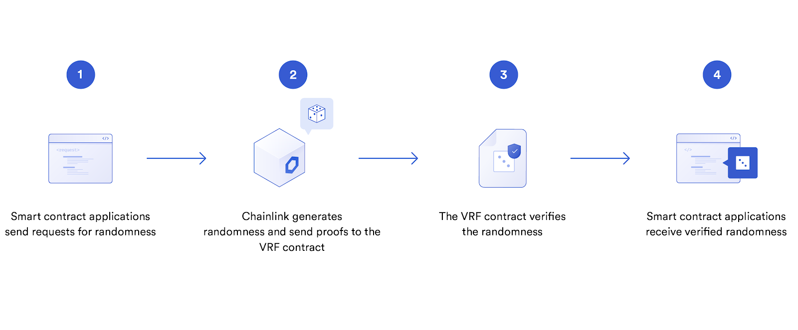

## Dice-betting-game
### Introduction
In this project we've attempted to make a dice game. A person will set a bet (i.e., he is betting some amount of ethere saying that the particular number will be the 
result of the dice). When we roll the dice i.e., call the RNG function, it gives a number between 1 to 6 (inclusive) and if the bet matches the number
they win some ethers.

### Running the contract:
(Make sure that the contract has funds)
1.  After cloning run `npm install` so that it installs all the necessary packages
2.  Then `npm start`
3.  Make sure to have [Metamask](https://chrome.google.com/webstore/detail/metamask/nkbihfbeogaeaoehlefnkodbefgpgknn?hl=en) installed.
4.  Use the Rinkbey faucets to get Ethers and Link tokens to interact with the smart contract.
5.  Now just play!

### Random Number Generator
Since the blockchain is constantly growing, and the ID of each block hash constantly changing, we can just use that block has to get a random number. Like this:
```
function random() private view returns(uint){
    return uint(keccak256(abi.encodePacked(block.difficulty, now, players)));
}
```
A miner has the choice to publish a block or not. If they mine a block that they don’t like they can throw it out!
If a group of miners do this, your numbers aren’t random anymore! This is feasibly quite easy for miners to do, and is 
rational for them to do too. Let’s say a miner signs up for a decentralized lottery for 10,000 ETH, and the winning ticket depends on the blockhash. 
They will just keep mining blocks and not publishing till they get the block they want! And they are 
incentivized to do this, since they will only be forgoing maybe 2–3 ETH, whereas if they win, the upside is massive. 
Hence, it's always advised to use an API/Oracle to generate random number. In this mini-project we've used Chainlink's VRF (Verifiable Random Function).

